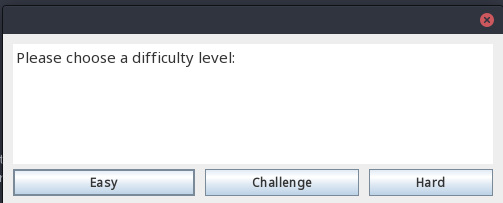
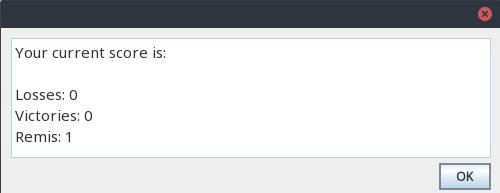

# java_tic_tac_toe

Implementation of TicTacToe in Java to get back up to speed and the implementation reflects that goal.


## Current features

## Different Difficulties 


## Score Keeper:



## Installation

First clone the repository:
```bash
git clone https://github.com/HubReb/java_tic_tac_toe 
```
You can then either use open the project in your IDE of choice and proceed 
accordingly.

The repo also contains the `pom.xml`to build the project with maven.
The current configuration allows the usage of the jar-file as a stand-alone
application.

If it is not installed, first install and configure maven. 
Then run
```bash
maven clean package
```
This will create the jar-file in the target folder.
You can then start the game simply by
```bash
java -jar ${path_to_jar}
```


## TODOs:
 * move from Swing to JavaFX (improve GUI)
 * improve communication between GUI and logic
